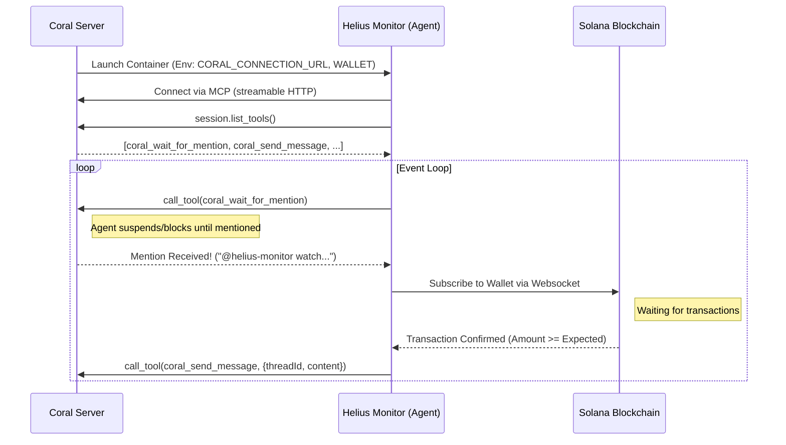

# Deep Architecture: Helius Monitor as a Coral Agent

This document provides a deep architectural breakdown of how the `helius-monitor` agent operates within the Coral ecosystem. It explains the responsibilities of the agent, how it leverages the Coral Server via the Model Context Protocol (MCP), the communication flows, and how this pattern can be expanded.

## 1. High-Level Concept

The `helius-monitor` is not a standalone LLM script; it is a **first-class deterministic worker agent** running inside a Coral Server session. 

Instead of polling an API and printing to stdout (like the old standalone version), this agent is managed entirely by Coral. Coral launches it, provisions its environment, and acts as the message broker between this agent, other agents, and the user.

### Why use Coral for a Deterministic Task?
Even though monitoring a Solana wallet doesn't require an LLM, integrating it as a Coral agent provides massive benefits:
*   **Orchestration:** Coral handles the lifecycle (starting/stopping the container).
*   **Session Context:** The agent is aware of threads and participants.
*   **Interoperability:** It can be mentioned by an LLM agent ("@helius-monitor watch for 5 SOL") and report back in the same thread ("Payment received!"), allowing complex multi-agent workflows where LLMs handle reasoning and deterministic agents handle execution.

---

## 2. Component Architecture

### 2.1 The Registry (`coral-agent.toml`)
Coral uses a local registry to discover available agents. The `coral-agent.toml` file defines the agent's identity, expected configuration (`options`), and how to run it.

```toml
[agent]
name = "helius-monitor"
version = "0.1.0"

[options]
WALLET = { type = "string", description = "Recipient wallet pubkey" }
AMOUNT_SOL = { type = "f64", default = 0.5, description = "Expected payment" }

[runtimes.docker]
image = "helius-monitor:0.1.0"
```
*   **Significance:** Coral parses this to know *how* to launch the agent (via Docker) and *what* variables to inject into its environment when a session starts.

### 2.2 The Session Controller (`session.json`)
A session is instantiated via a REST call to Coral (`POST /api/v1/local/session`). The JSON payload defines the "Agent Graph"—which agents are participating and what their specific runtime options are for this session.

```json
{
  "id": { "name": "helius-monitor", "version": "0.1.0" },
  "provider": { "type": "local", "runtime": "docker" },
  "options": {
    "WALLET": { "type": "string", "value": "111111..." }
  }
}
```

### 2.3 The Runtime Injection
When the session starts, the Coral Server talks to the host Docker daemon (`/var/run/docker.sock`) to spin up the `helius-monitor:0.1.0` container. 

Coral injects two critical things into the container's environment:
1.  **The Options:** `WALLET`, `AMOUNT_SOL`, etc., mapped directly from the session JSON.
2.  **`CORAL_CONNECTION_URL`:** A unique, session-specific MCP endpoint (e.g., `http://host.docker.internal:5555/mcp/v1/<uuid>/mcp`).

### 2.4 The Agent Logic (`coral_agent.py`)
The agent boots up, reads the injected environment, and connects back to Coral using the MCP `streamable_http` client.



---

## 3. Deep Dive: MCP and Communication

The integration relies heavily on the **Model Context Protocol (MCP)**. Coral Server acts as the MCP Server, and the agent acts as the MCP Client.

### Tool Discovery
Because Coral exposes its capabilities as tools, the agent doesn't need a hardcoded REST SDK. It calls `session.list_tools()` and dynamically finds the functions it needs to interact with the thread.

### The Waiting Pattern (`coral_wait_for_mention`)
Unlike typical REST APIs where you might use webhooks or polling, Coral uses a synchronous blocking tool for event ingestion. 
The agent calls `coral_wait_for_mention(maxWaitMs=30000)`. If no one mentions the agent in the session within 30 seconds, the tool returns empty, and the agent simply calls it again. This creates a highly resilient, long-polling architecture without needing an open listening port on the agent container.

### The Puppet API
In our testing, we used the "Puppet API". This is a Coral feature that allows an external system (like our bash script) to inject messages into a session *masquerading* as a participant.
Because an agent cannot mention itself, we introduced `user-proxy`—an idle agent. We tell Coral: "Pretend you are `user-proxy`, create a thread, and send a message mentioning `helius-monitor`." 
This triggers the `coral_wait_for_mention` lock in the `helius-monitor` container.

---

## 4. How to Expand This Architecture

This pattern—**Registry → Session Graph → MCP Connection → Tool Loop**—is the blueprint for adding *any* capability to Coral. 

### Expansion 1: Multi-Agent Workflows
Right now, `user-proxy` is a dumb terminal. Imagine replacing it with an LLM agent (e.g., `sales-agent`).
1. User chats with `sales-agent` on a web UI.
2. User says, "I want to buy the premium tier."
3. `sales-agent` generates a Solana Pay link.
4. `sales-agent` internally mentions: `@helius-monitor watch wallet XYZ for 5 SOL`.
5. `helius-monitor` wakes up, watches the chain, and replies to the thread: `payment-received`.
6. `sales-agent` sees this and tells the user: "Thank you! Your account is upgraded."

### Expansion 2: Adding Execution Capabilities (Tx Signer)
You can create a new agent, `solana-signer`, that holds a hot wallet key.
*   **Tools it exposes:** `transfer_sol`, `mint_nft`.
*   **Flow:** The `helius-monitor` detects a payment, mentions `@solana-signer`, and says `payment received, mint NFT to sender ABC`. The signer agent wakes up, executes the on-chain transaction, and reports success.

### Expansion 3: Dynamic Tool Registration
Currently, `helius-monitor` consumes Coral's tools (`wait_for_mention`). However, MCP allows the client to *provide* tools to the server. 
In the future, `helius-monitor` could expose a tool `get_current_balance(wallet)` back to Coral. If an LLM agent in the session is asked "Did I pay enough?", the LLM can invoke `get_current_balance` directly through Coral, which routes the execution to the `helius-monitor` container.

## 5. Summary of the "Coral Way"
1. **Containerized:** Every agent is isolated.
2. **Declarative:** `coral-agent.toml` defines the contract.
3. **Session-Scoped:** Configuration (`WALLET`) is injected per session, allowing 100 concurrent sessions to run 100 isolated monitors.
4. **Tool-Driven:** Communication happens via `call_tool` over MCP, ensuring standardized interactions regardless of what language the agent is written in.
